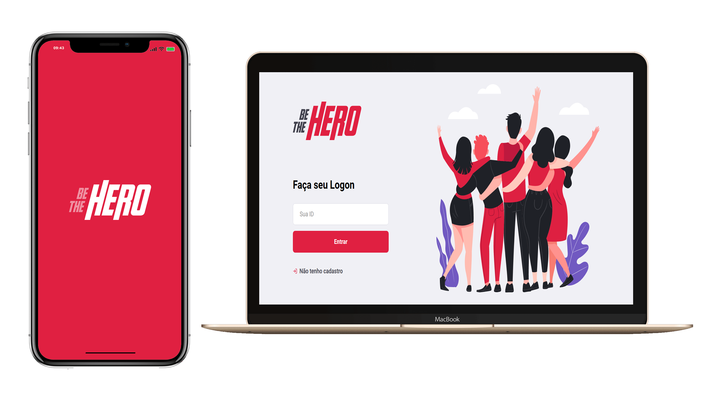

<h1 align="center">
    
</h1>

<h4 align="center">
    💜 Semana OmniStack 11 💜  
            March 23 - 27    
</h4>

  <a href="#rocket-tecnologias">Tecnologias</a>&nbsp;&nbsp;&nbsp;|&nbsp;&nbsp;&nbsp;
  <a href="#-projeto">Projeto</a>&nbsp;&nbsp;&nbsp;|&nbsp;&nbsp;&nbsp;
  <a href="#-principais-conceitos-abordados">Conceitos</a>&nbsp;&nbsp;&nbsp;|&nbsp;&nbsp;&nbsp;
  <a href="#-configuracao-do-projeto">Configurações</a>&nbsp;&nbsp;&nbsp;|&nbsp;&nbsp;&nbsp;
  <a href="#memo-licença">Licença</a>

 

  

## :rocket: Tecnologias

- [Node.js](https://nodejs.org/en/)
- [React](https://reactjs.org)
- [React Native](https://facebook.github.io/react-native/)
- [Expo](https://expo.io/)
- [Knex](http://knexjs.org/)

## 💻 Projeto

A ideia do 'Be the Hero' é permitir a conexão entre ONGs ou Instituições necessitadas e boas pessoas que possam apoiá-las.

## 📚 Principais conceitos abordados
**Backend**

- Criação de métodos HTTP
- Criação de banco de dados SQLite 3 utilizando Knex
- Rotas Express

**Web**

- Utilização do Axios para consumo da API criada no <a href="#Backend">Backend</a>
- Rotas [React Router](https://reacttraining.com/react-router/web/guides/quick-start)
- React Hooks

**Mobile**

- Utilização da plataforma [Expo](https://expo.io/)
- Estilização própria
- Deep Linking

  

## 🤔 Configuração do projeto

- Clone o repositório
- Instale todas as dependências
- Execute a API dentro do repositório [backend]('./backend/') -> *npm start*

**Aplicação Web**: Dentro do repositório [frontend](frontend) -> *npm start*

**Aplicação Mobile**: Dentro do repositório [mobile](mobile)
- Execute *yarn start* 
- Na página que abrirá, você terá a opção de rodar de aplicação dentro de um emulador ou em seu próprio dispositivo
  
 **Emulador** : Abra seu emulador e clique na opção desejada no navegador
 
 **Dispositivo** : Escaneie o QR Code dentro da [plataforma Expo](https://play.google.com/store/apps/details?id=host.exp.exponent&hl=pt_BR) de seu aparelho

 

##:memo: Licença

Esse projeto está sob a licença MIT.

